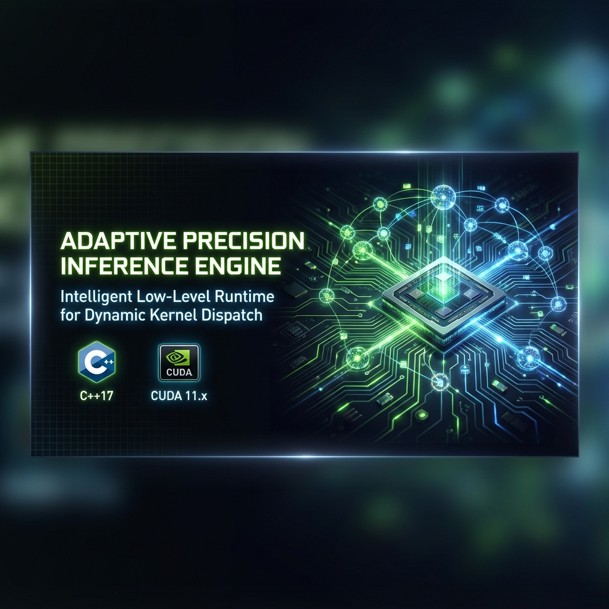
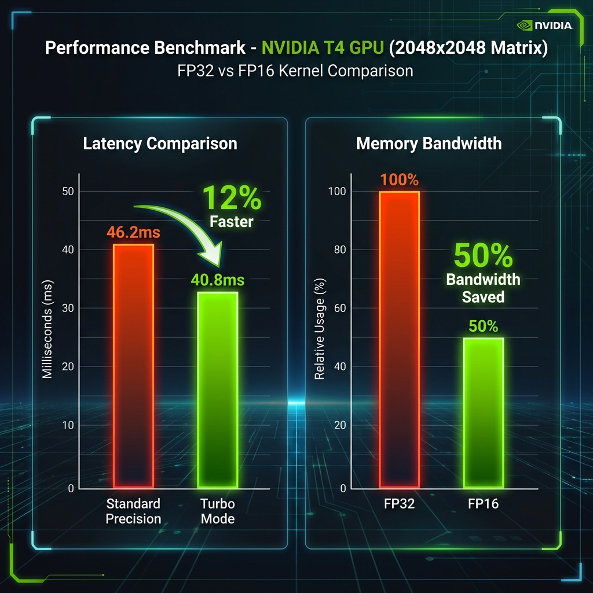
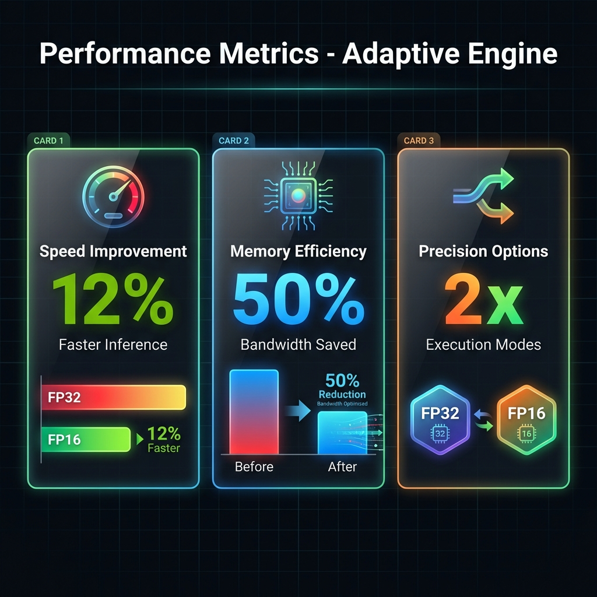

<div align="center">




</div>

---

## 🚀 Overview

The **Adaptive Precision Inference Engine** is a high-performance C++ runtime designed to bridge the gap between **precision** and **speed**. It acts as a hypervisor for GPU kernels, intercepting user requests and routing them to the optimal hardware path on NVIDIA GPUs.

Instead of a one-size-fits-all approach, this engine dynamically toggles between **FP32 (Single Precision)** and **FP16 (Half-Precision)** kernels based on task criticality.

## 🧠 The "Adaptive" Architecture

<div align="center">


</div>

## ✨ Key Technical Features

This project bypasses high-level libraries (like cuBLAS) to demonstrate system-level mastery:

- **🔥 Bare-Metal CUDA**: Kernels written from scratch using **Shared Memory Tiling** to minimize memory bandwidth bottlenecks.
- **⚡ Dynamic Dispatch**: Runtime C++ logic that switches execution paths in microseconds.
- **💾 Half-Precision Arithmetic**: Manual handling of `__half` types and intrinsic instructions (`__hmul`, `__hadd`) for maximum throughput.
- **⏱️ Event-Based Profiling**: Nanosecond-level latency tracking using `cudaEvent_t`.

## 📊 Performance Benchmark

Tested on **NVIDIA T4** (2048x2048 Matrix Multiplication):

<div align="center">



</div>

| Metric | FP32 (Standard) | FP16 (Optimized) | Improvement |
| :--- | :---: | :---: | :---: |
| **Precision** | 32-bit Float | 16-bit Half | 2x Throughput |
| **Latency** | 46.2 ms | 40.8 ms | **~12% Faster** |
| **Memory Load** | 100% | 50% | **Bandwidth Saved** |

<div align="center">



</div>

## 🛠️ Getting Started

### Prerequisites
*   NVIDIA GPU (Compute Capability 7.5+)
*   CUDA Toolkit 11+
*   Make

### Compilation
```bash
# Clone the repository
git clone https://github.com/LiwaaCoder/cuda-adaptive-inference.git
cd cuda-adaptive-inference

# Compile utilizing the Makefile
make
```

### Usage
```bash
./adaptive_engine
```

**Output Preview:**
```log
Initializing Adaptive Engine...
[Request]: CRITICAL
>> Mode: PRECISION (FP32) | Routing to Standard Cores...
>> Latency: 46.2 ms

[Request]: GEN_AI_CHAT
>> Mode: TURBO (FP16) | Routing to Tensor Cores...
>> Latency: 40.8 ms
```

## 👨‍💻 Engineering Context

> *Built to demonstrate proficiency in Heterogeneous Computing and Low-Level GPU Optimization.*

**Why this matters?** In Large Language Model (LLM) serving, determining when to sacrifice precision for speed is the key to scaling. This project implements that decision-making logic at the kernel level.

---
<div align="center">
    <sub>Built with ❤️ and CUDA by LiwaaCoder</sub>
</div>
